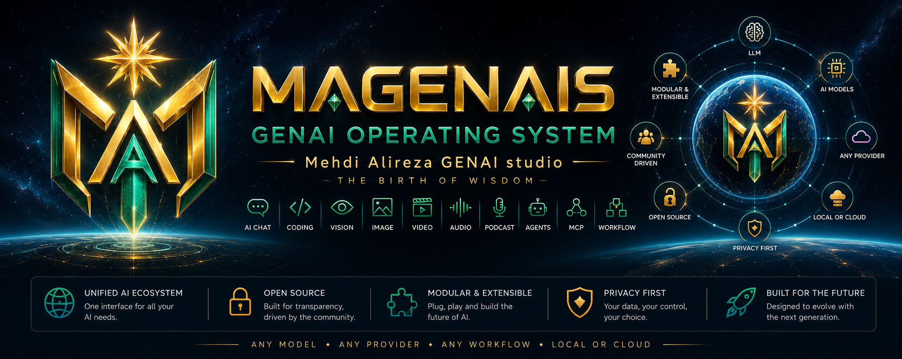

  

<h1 align="center">
MAGENAIS
</h1>

<h3 align="center">
The Browser-First AI Operating System
</h3>

Build Once • Connect Everything • Own Your AI Workspace

---

> **The Birth of Wisdom Begins Here.**

MAGENAIS is an open-source, browser-first Artificial Intelligence Operating System that unifies modern AI technologies into a single modular, extensible, and provider-agnostic platform.

Instead of switching between dozens of disconnected AI applications, websites, APIs, and proprietary ecosystems, MAGENAIS provides one intelligent workspace capable of orchestrating every AI capability from a single interface.

Whether your workflow involves Large Language Models, image generation, coding assistants, music synthesis, speech, video creation, agents, workflows, retrieval systems, or future AI technologies, MAGENAIS provides one consistent architecture for all.

---

# Why MAGENAIS?

Artificial Intelligence is evolving faster than traditional software architecture.

Every month introduces:

- new LLM providers
- new image models
- new video generators
- new speech engines
- new music generators
- new agent frameworks
- new APIs
- new workflows

Unfortunately, every service introduces another dashboard, another authentication method, another pricing model, another API, another user interface, and another workflow paradigm.

The result is fragmentation.

Users waste time learning tools instead of creating solutions.

MAGENAIS exists to eliminate this fragmentation.

Instead of learning twenty AI applications...

learn one AI Operating System.

---

# Vision

We believe Artificial Intelligence should behave like an operating system rather than a collection of isolated applications.

In the future:

Applications become intelligent workspaces.

Models become interchangeable execution engines.

Providers become hardware drivers.

Plugins become applications.

Workflows become executable programs.

Projects become persistent AI environments.

Assets become reusable knowledge.

Users—not vendors—remain in control of their data.

MAGENAIS aims to become the universal operating system for the AI era.

---

# Mission

MAGENAIS exists to democratize Artificial Intelligence by providing an open, extensible, browser-native platform that anyone can use, modify, extend, and share.

Our mission is to remove barriers between people and AI by enabling:

• one interface

• unlimited providers

• unlimited workflows

• unlimited plugins

• unlimited creativity

without vendor lock-in.

---

# Core Philosophy

Every architectural decision inside MAGENAIS follows these principles.

## 1. Browser First

The browser has become the world's most universal runtime.

MAGENAIS is designed to run directly inside modern browsers using open web technologies without requiring complex server infrastructure for the core platform.

---

## 2. Open Source

Knowledge grows through collaboration.

MAGENAIS is developed in the open and welcomes contributions from developers, researchers, educators, designers, and creators worldwide.

---

## 3. Provider Agnostic

No AI provider should dominate the platform.

Every provider is treated as a replaceable component connected through a unified abstraction layer.

Users choose providers.

Providers do not choose users.

---

## 4. Plugin Everything

Every major capability should be extensible.

If a feature can be implemented as a plugin...

it should be a plugin.

The core remains lightweight while the ecosystem grows indefinitely.

---

## 5. Workflow Driven

Artificial Intelligence is no longer about individual prompts.

Modern AI applications require reusable, visual, executable workflows capable of combining multiple providers, tools, and agents.

MAGENAIS is designed around workflows rather than isolated conversations.

---

## 6. Modular Architecture

Large software systems survive through separation of concerns.

Every subsystem inside MAGENAIS has a clearly defined responsibility, interface, and lifecycle.

Modules communicate through well-defined APIs rather than direct dependencies.

---

## 7. Privacy Respecting

User data belongs to the user.

MAGENAIS minimizes unnecessary data collection and enables local execution whenever possible.

Privacy is treated as a design requirement rather than an optional feature.

---

## 8. Local First

Cloud AI is powerful.

Local AI is empowering.

MAGENAIS embraces both.

The platform supports cloud providers, local models, self-hosted inference servers, and hybrid deployments through one unified architecture.

---

## 9. Community Powered

The long-term success of MAGENAIS depends on its ecosystem rather than its core.

Plugins.

Providers.

Themes.

Workflows.

Documentation.

Educational content.

Community innovation is considered the primary engine of growth.

---

## 10. AI Native

MAGENAIS is not traditional software with AI added later.

Artificial Intelligence is the foundation of every architectural decision.

Every subsystem is designed assuming AI will continue evolving rapidly over the coming decades.

---

# Design Principles

The platform follows several high-level engineering principles.

- Simplicity before complexity.
- Composition before inheritance.
- Interfaces before implementations.
- Extensibility before customization.
- Open standards before proprietary solutions.
- Performance through modularity.
- Browser compatibility by default.
- Progressive enhancement.
- Stable APIs.
- Backward compatibility whenever possible.

---

# What Makes MAGENAIS Different?

MAGENAIS is not merely another chatbot.

It is not another prompt editor.

It is not another workflow application.

It is not another provider wrapper.

Instead, MAGENAIS introduces a new software category:

> **AI Operating System**

An operating system responsible for coordinating:

- AI Providers
- AI Models
- Plugins
- Agents
- Workflows
- Projects
- Assets
- User Interfaces
- Extensions
- Intelligent Automation

through one coherent architecture.

---

# Design Inspiration

MAGENAIS does not reinvent proven ideas.

Instead, it learns from the world's most successful software ecosystems.

| Project | Inspiration |
|----------|-------------|
| Visual Studio Code | Extension System |
| ComfyUI | Graph Execution Engine |
| LangFlow | AI Workflow Design |
| OpenWebUI | Unified AI Interface |
| Kubernetes | Modular Architecture |
| Obsidian | Local-First Philosophy |
| Docker | Portable Environments |
| React | Component Architecture |
| Vite | Modern Build System |
| Progressive Web Apps | Browser Deployment |

These projects inspired individual architectural concepts.

MAGENAIS combines them into one unified browser-native AI Operating System.

---

# Core Capabilities

MAGENAIS is designed to become a complete AI workspace supporting:

- Conversational AI
- AI Coding
- Vision
- Image Generation
- Video Generation
- Audio Processing
- Speech Synthesis
- Music Generation
- Podcast Production
- AI Agents
- MCP Integration
- Workflow Automation
- Prompt Engineering
- Asset Management
- Project Management
- Knowledge Retrieval
- Future AI Modalities

All powered by one consistent architecture.

---

# Guiding Motto

> **Build Once. Connect Everything. Own Your AI Workspace.**

MAGENAIS is not built around one model.

It is not built around one provider.

It is not built around one company.

It is built around one idea:

**Artificial Intelligence should be open, modular, extensible, and universally accessible.**

